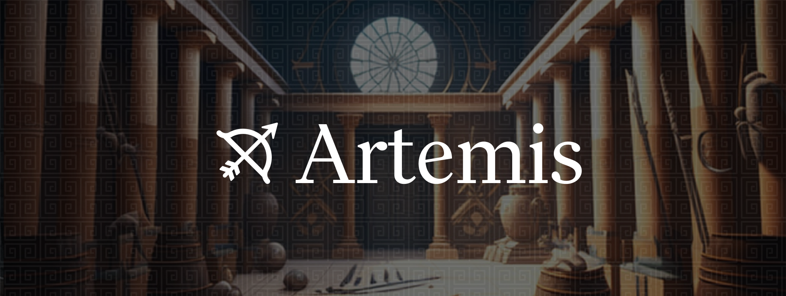

[][gh-ci]
[![Telegram Chat][tg-badge]][tg-url]

[gh-ci]: https://github.com/paradigmxyz/reth/actions/workflows/rust.yml
[tg-badge]: https://img.shields.io/badge/chat-telegram-blue

## What is Artemis?

Artemis is a framework for writing MEV bots in Rust. It's designed to be simple, modular, and fast. 

At it's core, Artemis is architected as an event processing pipeline. The library is made up of three main components: 

1. *Collectors*: *Collectors* take in external events (such as pending txs, new blocks, marketplace orders, etc. ) and turn them into an internal *event* representation. 
2. *Strategies*: *Strategies* contain the core logic required for each MEV opportunity. They take in *events* as inputs, and compute whether any opportunities are available (for example, a strategy might listen to a stream of marketplace orders to see if there are any cross-exchange arbs). *Strategies* produce *actions*.
3. *Executors*: *Executors* process *actions*, and are responsible for executing them in different domains (for example, submitting txs, posting off-chain orders, etc.).

## Strategies 

The following strategies have been implemented: 

- [Opensea/Sudoswap NFT Arbitrage](/crates/strategies/opensea-sudo-arb/): A strategy implementing atomic, cross-market NFT arbitrage between Seaport and Sudoswap.

## Build, Test and Run

In order to build, first clone the github repo: 

```sh
git clone https://github.com/paradigmxyz/artemis
cd artemis
```

Next, run tests with cargo: 

```sh
cargo test --all
```

The simplest way to run is Artemis is with the following command: 

```sh
cargo run
```

For convenience, we also provide a dockerized deployment to launch Artemis along with a monitoring and alerting services. You can do this by running 

```sh
docker compose up 
```


[tg-url]: https://t.me/artemis_devs